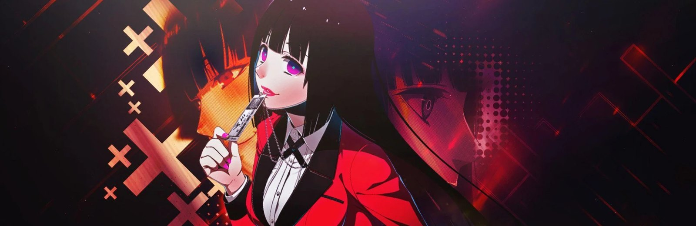
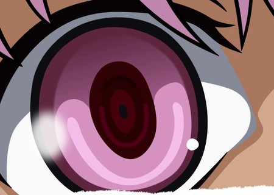
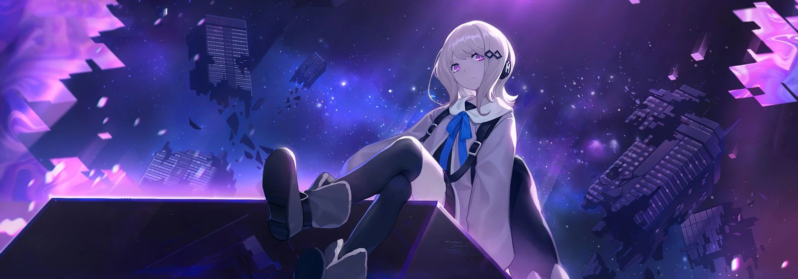
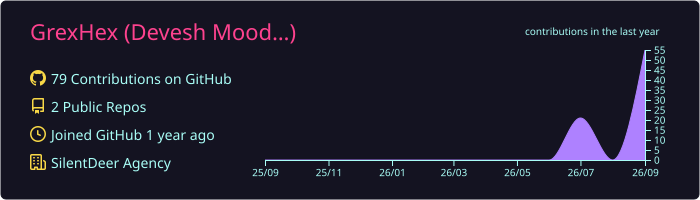
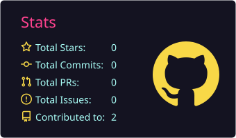
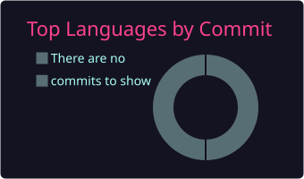
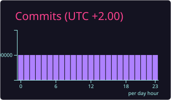
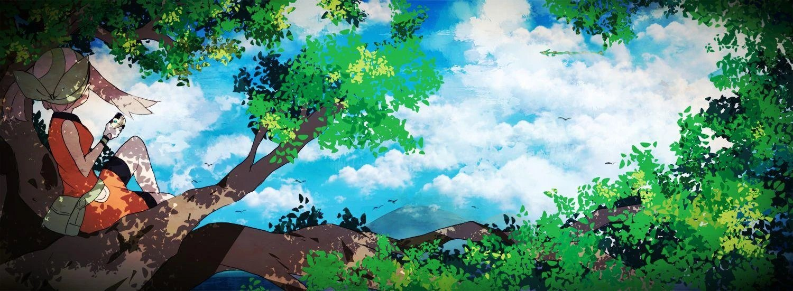

  

  
   
  
  

 

  

 

---

  

<h2 align="center">Tools &amp; Tech</h2>

  

---

  

<h2 align="center">Stats</h2>

  
  
  
  

  

---

<h2 align="center">Snake</h2>

  <picture>
    <source media="(prefers-color-scheme: dark)" srcset="https://raw.githubusercontent.com/GrexHex/GrexHex/output/github-snake-dark.svg" />
    <source media="(prefers-color-scheme: light)" srcset="https://raw.githubusercontent.com/GrexHex/GrexHex/output/github-snake.svg" />
    
  </picture>

---

  

